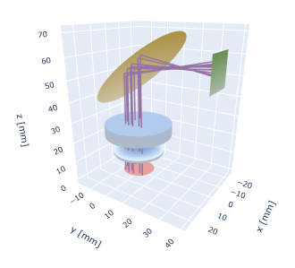
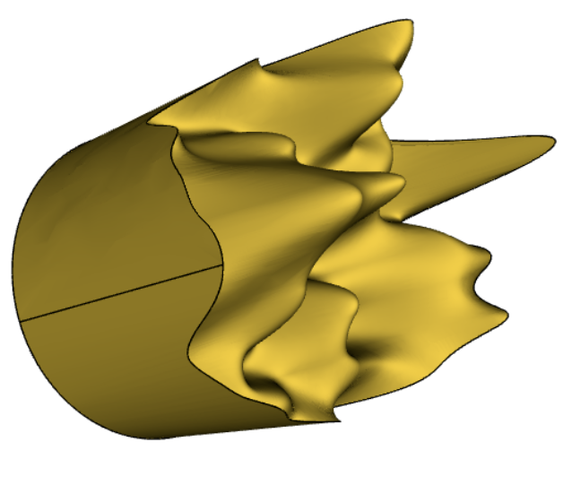
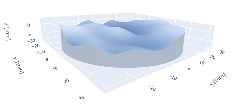

# DiffinyTrace

**DiffinyTrace** is a Python library for differentiable ray tracing and optical system optimization using PyTorch. It enables automatic differentiation through optical systems, making it possible to optimize lens designs, mirror configurations, and other optical components using gradient-based methods.

The source code is available at the [GitHub repository](https://github.com/martinpflaum/diffinytrace).

## Key Features

<div align="center">

<p><strong>Flexible Transformations</strong> — apply general transformations such as rotations and translations to optical components, with full control over the parameters and their role in the transformation.</p>
</div>

<div align="center">

<p><strong>Seamless CAD Export</strong> — generate lenses and mirrors that can be exported to standard CAD file formats.</p>
</div>

<div align="center">

<p><strong>Freeform Surfaces</strong> — design complex optical elements with advanced B-spline representations for maximum flexibility.</p>
</div>

* **Differentiable Ray Tracing**: Full automatic differentiation support through optical systems
* **Constraint Optimization**: Advanced optimization with PyTorch and SciPy integration
* **Illumination Design**: Algorithms for computing lens surfaces to achieve desired illumination profiles
* **GPU Acceleration**: CUDA support for high-performance computations

## Installation
Python version 3.12
DiffinyTrace requires **PyTorch** and **Cadquery OCP** to be installed. You will need to install these libraries by hand.

1. **Create a new Enviroment** via conda:
   ```bash
   conda create -n dit python==3.12
   ```
   activate enviroment via
   ```bash
   conda activate dit
   ```
   install pip
   ```bash
   conda install pip
   ```
   
   
2. **Install PyTorch**
   Check your cuda version with 
   ```bash
   nvcc --version
   ```
   
   Diffinytrace only has been tested with 2.10.0+cu130. Make sure to install the appropriate version of PyTorch for your system. You can find the installation instructions on the [PyTorch website](https://pytorch.org/get-started/locally/). DiffinyTrace should work for both cpu and cuda versions.

3. **Install DiffinyTrace**
   Install all other dependencies and the library itself via:
   ```bash
   pip install diffinytrace
   ```
   or directly in the folder via
   ```bash
   pip install -r requirements.txt
   ```
   
### Tested Versions

DiffinyTrace has been tested with the following versions:

| Library | Version |
| :--- | :--- |
| colour-science | 0.4.7 |
| matplotlib | 3.10.8 |
| numpy | 2.4.2 |
| pandas | 3.0.0 |
| Pillow | 12.0.0 |
| plotly | 6.5.2 |
| pvlib | 0.15.0 |
| scikit-learn | 1.8.0 |
| scipy | 1.17.0 |
| tqdm | 4.67.3 |
| cadquery | 2.7.0 |
| torch | 2.10.0+cu130 |

## Basic Usage Example

```python
import diffinytrace as dit
import torch
NBK7 = dit.materials["NBK7"]

wave_len = 1.024
light_transform = dit.transforms.Offset(torch.tensor([0.0,0.0,0.0]))
source = dit.source.CollimatedMonochromatic(light_transform,8.0,wave_len)

plane_surface = dit.Plane()
surface2 = dit.Aspheric(-1/50.)
transf1 = dit.transforms.Distance(10.0,parent_transform=source)
lens1 = dit.Lens(transf1,5.,plane_surface,surface2,NBK7,13.0)
transf2 = dit.transforms.Distance(15.0,parent_transform=lens1)
detector = dit.Detector(transf2,plane_surface,8.0)
system = dit.SequentialOpticalSystem({"source":source, "lens":lens1, "detector":detector})

x,weights = source.sample(10)
O,D,wave_len,_,meta_data = system(x,["source","lens","detector"])
dit.plotting.system2D.plot(system,meta_data)
```

## Documentation

For comprehensive documentation, tutorials, and API reference, visit the [full documentation](https://martinpflaum.github.io/diffinytrace/).

## License

DiffinyTrace is licensed under the MIT License. See the repository for full license details.